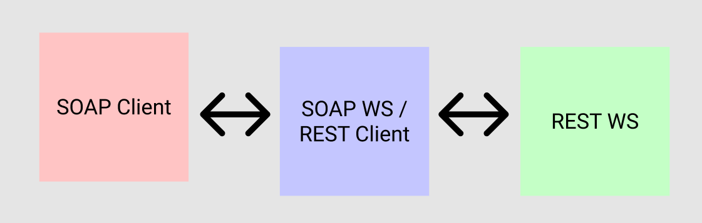
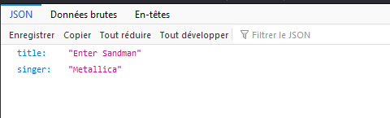
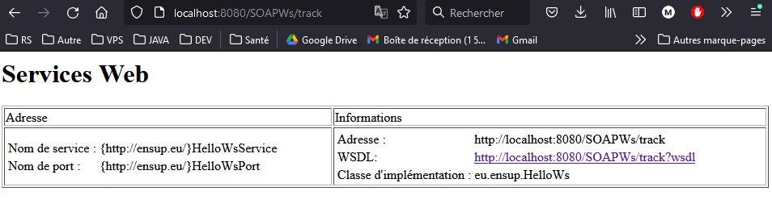
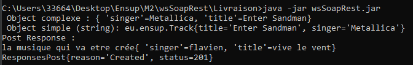
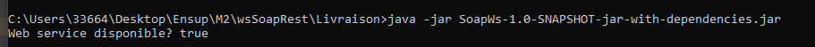

## Réalisation de 2 web services un qui est de type SOAP et un REST qui communique entre eux et qui est accessible via un client.

# Mise en place d'un client qui interroge un service web

Ce client contact un web service SOAP ensuite le Ws SOAP contact un Ws Rest qui va faire des actions et qui va renvoyer les informations au client en repassant par le ws SOAP et qui va etre renvoyé au client SOAP

#Prérequis

* Version de java : 1.8 
* Tomacat en java 1.8 sur le port 8080

#Lancement de l'application avec le dossier "Livraison2war1jar"

1. installer le "restfulexample.war" et "SOAPWs.war" dans votre tomcat en java 1.8 sur le port 8080
   
1.1.Verifier que le server restfulexample est lancé sur ce lien : http://localhost:8080/restfulexample/rest/json/metallica/get
   Le resultat de ce lien :
   
   
1.2. Verifier que le server SOAPWs est lancé sur ce lien : http://localhost:8080/SOAPWs/track
   Le resultat de ce lien :
   
2. lancer la commande suivante : "java -jar wsSoapRest.jar"
   Le resultat de cette commande :

#Lancement de l'application avec le dossier "Livraison1war2jar"

1. installer le "restfulexample.war" dans votre tomcat en java 1.8 sur le port 8080
2.verifier que le server est lancé sur ce lien : http://localhost:8080/restfulexample/rest/json/metallica/get
   Le resultat de ce lien : 
   
3. Rendrez-vous dans le dossier livraison a partir d'un invité de commande
4. lancer la commande suivante : "java -jar SoapWs-1.0-SNAPSHOT-jar-with-dependencies.jar"
  Le resultat de cette commande :
5. Relancer un terminal et rendez-vous dans le dossier livraison 
6. lancer la commande suivante : "java -jar wsSoapRest.jar"
   Le resultat de cette commande :
